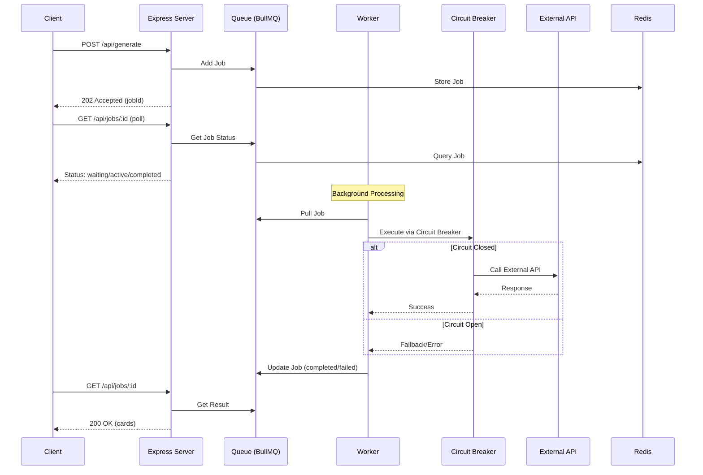
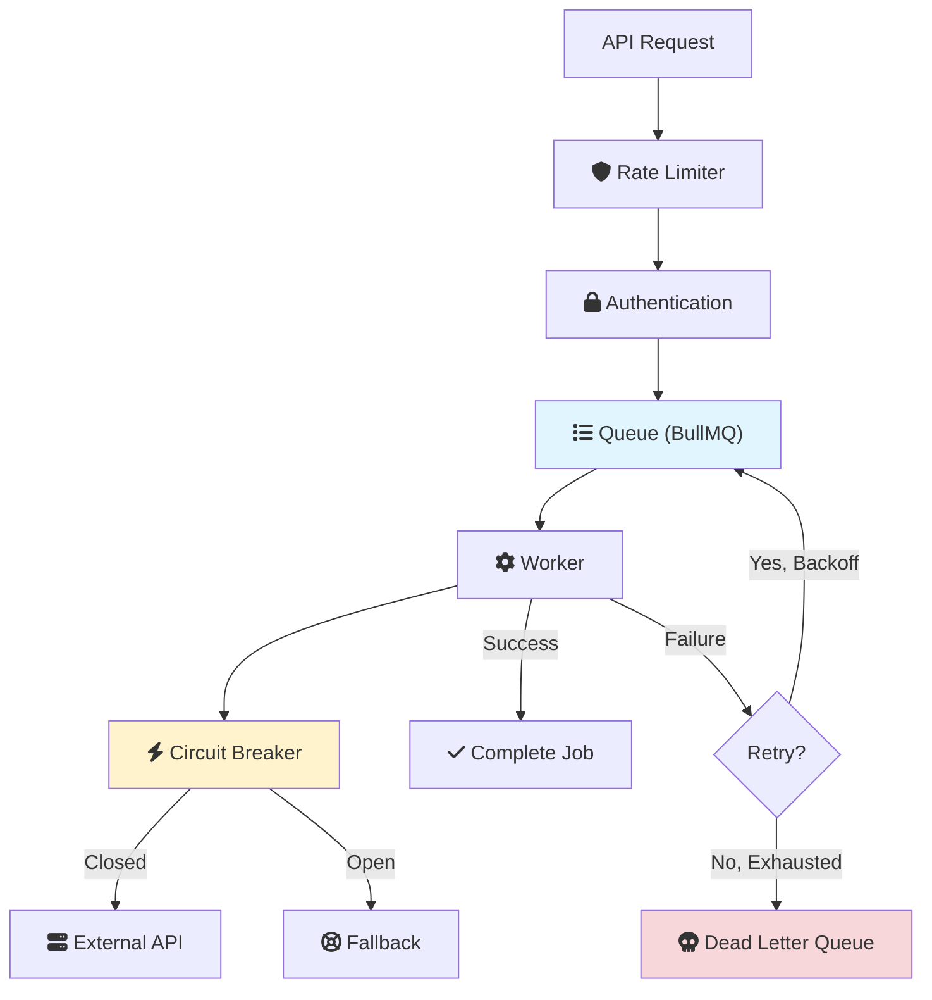
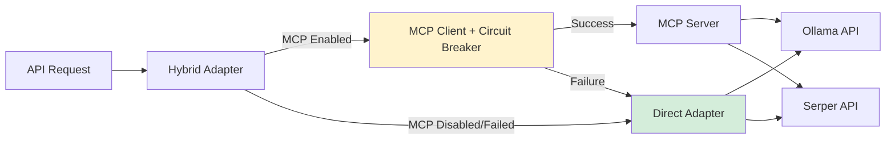

# MindFlip AI

**A backend-focused service for AI-powered flashcard generation and study assistance.**

This project implements a **Clean Architecture**-based API that leverages LLMs (Ollama, WebLLM) and web search (Serper) to generate high-quality educational content. The frontend is provided as a reference implementation to demonstrate the API's capabilities.

## Type Safety & Code Quality
- TypeScript strict mode is enabled (noImplicitAny, strictNullChecks, noUnusedLocals/Params, noFallthroughCasesInSwitch).
- Prefer `unknown` over `any`; add type guards at API/LLM boundaries. See `src/adapters/primary/express/validators.ts` for request guards.
- Core models are readonly and use literal unions for runtimes (`ollama` | `webllm`) and knowledge sources.
- ESLint config (`.eslintrc.cjs`) enforces: no explicit `any`, prefer-readonly, no non-null assertions, explicit return types for exported APIs.
- When adding routes, include a small runtime validator before using request bodies; keep assertions to a minimum.

## 🏗 Architecture

The system follows **Clean Architecture** principles to ensure separation of concerns, maintainability, and testability:

- **Core (Domain)**: Contains business logic and interfaces.
  - `StudyService`: Orchestrates generation, quiz creation, and deep dive logic.
  - `MetricsService`: Tracks usage and performance metrics.
- **Ports**: Defines interfaces for external dependencies.
  - `StudyUseCase`: Primary port for the application.
  - `LLMPort`, `SearchPort`: Secondary ports for AI and Search services.
- **Adapters**: Implements the ports.
  - **Primary**: 
    - `Express Server` (REST API).
    - `Apollo Server` (GraphQL API).
  - **Secondary**: 
    - `HybridOllamaAdapter`: Connects to Ollama via MCP or direct (with fallback).
    - `WebLLMAdapter`: Connects to browser-based LLM (via client bridge).
    - `HybridSerperAdapter`: Connects to Serper.dev via MCP or direct (with fallback).
    - `FileSystemAdapter`: Handles file I/O.
    - `SubscriptionService`: Handles real-time updates via PubSub (WebSocket ready).
    - **Runtime Preference + Fallback**: User-selectable runtime (Ollama or WebLLM). Server tries preferred runtime → alternate runtime → local fallback.
- **MCP Layer** (Optional, Feature Flag):
  - `MCPClientWrapper`: Connects to MCP server with circuit breaker.
  - `MCP Server`: Standalone process with tools for Ollama, Serper, etc.
  - Automatic fallback to direct adapters on failure.
- **Resilience Layer**:
  - `QueueService` (BullMQ): Background job processing with retry and DLQ.
  - `ResilienceService` (Opossum): Circuit breakers for external dependencies.
  - `LoggerService` (Winston): Structured logging.
  - `FlashcardCacheService`: In-memory cache for instant repeated queries.

### Request Flow



### Resilience Patterns



## 📖 API Documentation

### REST API

Interactive API documentation is available via **Swagger UI**:

- **URL**: `http://localhost:3000/api-docs`
- **Specification**: `swagger.yaml`

Explore and test all endpoints directly from your browser.

### GraphQL API ✨ NEW

The application now supports a modern GraphQL API alongside REST:

- **Endpoint**: `http://localhost:3000/graphql`
- **Documentation**: See [docs/graphql-api.md](docs/graphql-api.md) | [Examples](docs/graphql-examples.md)
- **Playground**: Apollo Sandbox available in development at `/graphql`

**Key Features:**
- 🔀 **Hybrid Mode**: Automatic fallback to REST API if GraphQL fails
- 🔐 **Full Authentication**: JWT-based auth for protected operations
- ⚡ **Efficient Queries**: Request only the data you need
- 🎯 **Type Safety**: GraphQL schema with strong typing
- 📦 **Batching Support**: Multiple operations in single request

**Enable GraphQL Mode:**
```javascript
localStorage.setItem('USE_GRAPHQL', 'true');
location.reload();
```

**LLM Runtime Preference (NEW):**
- Choose preferred runtime (Ollama or WebLLM) in the in-app **Settings** modal (header → Settings).
- The app will try your preference first, then automatically fall back to the other runtime, then to a local quiz fallback.

**Compare APIs:**
```bash
# REST: Multiple requests for deck + cards
curl /api/decks
curl /api/decks/:id

# GraphQL: Single request
curl -X POST /graphql -d '{
  "query": "{ deck(id: \"abc\") { topic cards { front back } } }"
}'
```

## ✨ Key Features

### Security & Authentication
- 🔐 **OAuth 2.0** (Google) for user authentication
- 🔒 **JWE Token Encryption** for secure sessions
- 🛡️ **Rate Limiting** (API: 100/15min, Auth: 5/hour)
- ✅ **Auth Middleware** protecting sensitive endpoints

### Performance & Resilience
- ⚡ **In-Memory Caching** for instant repeated queries (1 hour TTL)
- 🔄 **Background Queue** with retry and Dead Letter Queue (BullMQ)
- 🔌 **Circuit Breakers** preventing cascading failures (Opossum)
- 📊 **Structured Logging** for observability (Winston)
- 🎯 **Proactive Deep Dive** - auto-generates related topics in background

### MCP Integration (Optional)
- 🌐 **Model Context Protocol** server for external service calls
- 🔀 **Hybrid Adapters** with automatic fallback
- 🚦 **Feature Flag** (`USE_MCP_SERVER`) for safe rollout
- 💪 **Zero Downtime** - works with or without MCP

### AI & Search
- 🤖 Multiple LLM runtimes (Ollama, WebLLM)
- 🔍 Web search integration (Serper)
- 📄 PDF/Image processing for flashcard generation
- 🎓 Quiz generation from flashcards
- ✅ Validation & Self-Repair: Generated flashcards are validated for strict JSON/question-answer shape; if invalid/insufficient, the system re-prompts the runtime to repair before returning.
- 📏 Count Enforcement: Returned flashcards are trimmed/padded to match the requested count; client-side generation auto-falls back to backend if underfilled.
- 🛡️ Runtime fallback ladder: Preferred runtime (configurable) → alternate runtime → local quiz fallback to prevent failures when an LLM is unavailable

## 🚀 Getting Started

### Prerequisites
- **Node.js** ≥ 18 (tested with v22)
- **Redis** (for queue management)
- **Ollama** (optional, for local LLM - default model: llama3.2:latest)

> **Note**: This project uses `tsx` for TypeScript execution in development mode, which provides better compatibility with Node.js v22+ and ESM modules.

### Installation

1. **Clone the repository**
   ```bash
   git clone <repository-url>
   cd flash-card-study-helper-ai
   ```

2. **Install dependencies**
   ```bash
   npm install
   ```

3. **Configure Environment**
   ```bash
   cp .env.example .env
   ```
   
   **Required Variables:**
   ```bash
   # Google OAuth (for authentication)
   GOOGLE_CLIENT_ID=your_client_id
   GOOGLE_CLIENT_SECRET=your_client_secret
   
   # JWE Token Encryption
   JWE_SECRET_KEY=your_32_char_secret_key
   
   # Serper API (for web search)
   SERPER_API_KEY=your_serper_api_key
   
   # Ollama Configuration
   OLLAMA_BASE_URL=http://localhost:11434
   OLLAMA_MODEL=llama3.2:latest
   
   # Redis (for queue)
   REDIS_HOST=localhost
   REDIS_PORT=6379
   
   # MCP Feature Flag (optional, default: false)
   USE_MCP_SERVER=false
   ```

### Running the Service

**Development Mode** (Recommended for development)
```bash
# Start Redis
brew services start redis  # or docker run -p 6379:6379 redis

# Run in development mode (uses tsx for hot TypeScript execution)
npm run dev
```

**Production Mode**
```bash
# Build backend and frontend
npm run build:all

# Start Redis
brew services start redis  # or docker run -p 6379:6379 redis

# Start server
npm run serve
```

**With MCP Server** (Optional)
```bash
# Build MCP server
npx tsc -p mcp-server/tsconfig.json

# Enable MCP
export USE_MCP_SERVER=true

# Start in development mode
npm run dev
```

- **API Root**: `http://localhost:3000/api`
- **Swagger UI**: `http://localhost:3000/api-docs`
- **Demo Client**: `http://localhost:3000` (Quiz now lives inside the SPA; `Take Quiz` no longer redirects to `quiz.html`)
- **Health Check**: `http://localhost:3000/api/health`

## 📡 Key API Endpoints

### Flashcard Generation
| Method | Endpoint | Description | Auth |
| --- | --- | --- | --- |
| **POST** | `/api/generate` | Generate flashcards (async, returns jobId) | Yes |
| **GET** | `/api/jobs/:id` | Poll job status and retrieve results | Yes |
| **POST** | `/api/upload` | Upload PDF/Image for processing | Yes |

### Authentication
| Method | Endpoint | Description | Auth |
| --- | --- | --- | --- |
| **GET** | `/api/auth/google` | Initiate Google OAuth flow | No |
| **GET** | `/api/auth/google/callback` | OAuth callback (returns JWE token) | No |

### Admin & Monitoring
| Method | Endpoint | Description | Auth |
| --- | --- | --- | --- |
| **GET** | `/api/health` | Service health check | No |
| **GET** | `/api/queue/stats` | Queue statistics (jobs processed, DLQ, etc.) | Yes |
| **GET** | `/api-docs` | Interactive Swagger UI documentation | No |

*See Swagger UI for complete API reference and request/response schemas.*

## 🤖 AI Integration

The service supports multiple AI runtimes:

1.  **Ollama (Server-side)** - Default
    - Runs locally on the server
    - Powerful models (llama3.2, mistral, etc.)
    - Can use MCP server or direct connection
    - Configured via `.env`

2.  **WebLLM (Client-side)**
    - Runs in user's browser (WebGPU)
    - Zero server cost
    - Always uses direct connection (no MCP)

### MCP Architecture (Optional)



**Benefits:**
- Standardized interface for all external services
- Circuit breaker on all MCP calls
- Automatic fallback to direct adapters
- Zero breaking changes (opt-in via feature flag)

## 🛠 Project Structure

```bash
flash-card-study-helper-ai/
├── mcp-server/          # MCP Server (Optional)
│   ├── tools/           # MCP Tools (Ollama, Serper, etc.)
│   └── index.ts         # MCP Server Entry Point
├── src/
│   ├── adapters/
│   │   ├── primary/     # Express Server, Middleware
│   │   └── secondary/   # External Service Adapters
│   │       ├── mcp/     # MCP Client Wrapper
│   │       ├── ollama/  # Ollama Adapters (Direct + Hybrid)
│   │       └── serper/  # Serper Adapters (Direct + Hybrid)
│   ├── core/
│   │   ├── domain/      # Business Models
│   │   ├── ports/       # Interface Definitions
│   │   └── services/    # Core Business Logic
│   ├── graphql/         # GraphQL API (New)
│   │   ├── resolvers/   # Query/Mutation resolvers
│   │   ├── schema/      # Type definitions
│   │   └── plugins/     # Apollo plugins
│   └── index.ts         # Composition Root
├── public/              # Frontend Demo
├── tests/               # Unit & Integration Tests
└── swagger.yaml         # OpenAPI Specification
```

## 🧪 Testing

```bash
# Run all tests
npm test

# Run with coverage
npm test -- --coverage
```

**Test Coverage:**
- ✅ Unit tests for all core services (Cache, Auth, Resilience)
- ✅ Integration tests for API endpoints
- ✅ Workflow tests for cache-queue integration

## 🔧 Configuration Reference

### Feature Flags

| Variable | Default | Description |
|----------|---------|-------------|
| `USE_MCP_SERVER` | `false` | Enable MCP server integration |

### Caching

| Variable | Default | Description |
|----------|---------|-------------|
| `CACHE_LLM_TTL_SECONDS` | `86400` | LLM response cache TTL (1 day) |
| `CACHE_SERPER_TTL_SECONDS` | `3600` | Serper result cache TTL (1 hour) |

### Rate Limiting

- API endpoints: 100 requests per 15 minutes
- Auth endpoints: 5 requests per hour

## 📊 Monitoring

### Health Check
```bash
curl http://localhost:3000/api/health
# Response: {"ollama":true,"serper":true}
```

### Queue Stats
```bash
curl -H "Authorization: Bearer <token>" \
  http://localhost:3000/api/queue/stats
```

### Logs
- **Console**: Structured JSON logs (Winston)
- **Files**: `error.log`, `combined.log`

## 📝 License

MIT
