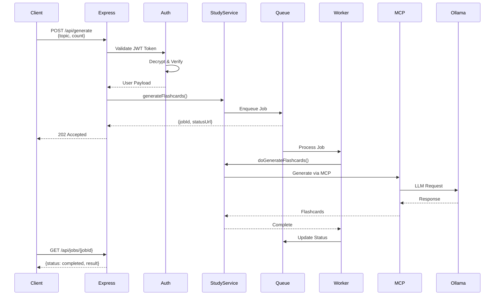
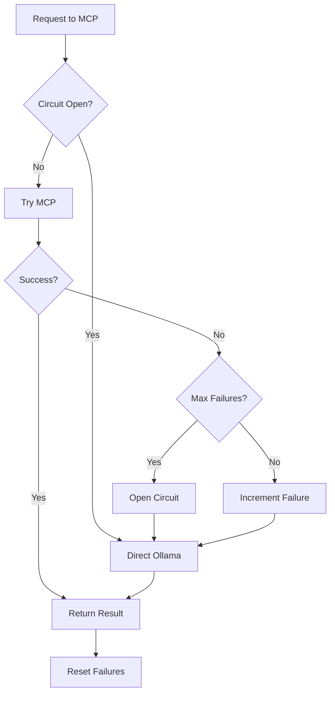
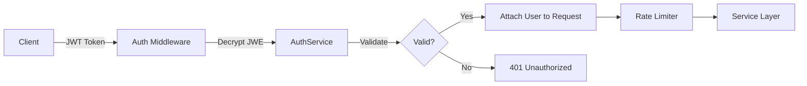
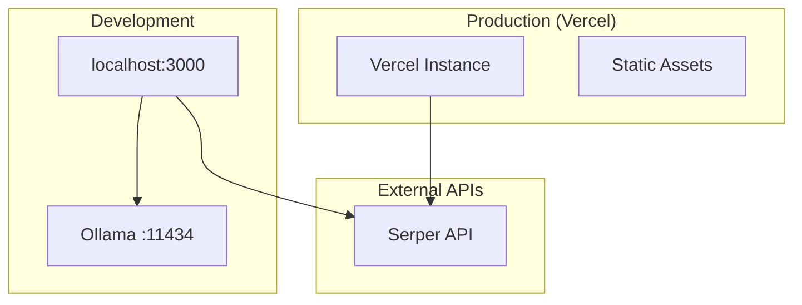

# MindFlip AI - System Architecture

**Last Updated**: 2025-12-09  
**Version**: 2.1 (MCP-First Architecture & robust Queue)

## High-Level Architecture

```mermaid
graph TB
    subgraph "Client Layer"
        WEB[Web Frontend]
        MOBILE[Mobile App<br/>React Native]
    end

    subgraph "API Gateway"
        EXPRESS[Express Server<br/>:3000]
        GQL[GraphQL<br/>/graphql]
        REST[REST API<br/>/api/*]
    end

    subgraph "Middleware Layer"
        AUTH[Auth Middleware<br/>JWE Tokens]
        RATE[Rate Limiter]
        CORS[CORS Handler]
    end

    subgraph "Service Layer"
        STUDY[StudyService]
        QUIZ[QuizService]
        AUTH_SVC[AuthService<br/>Singleton]
        METRICS[MetricsService]
    end

    subgraph "Queue System"
        BULL[BullMQ (Redis)<br/>or In-Memory Fallback]
        WORKER[Queue Worker]
        CACHE_SVC[FlashcardCache]
    end

    subgraph "Adapter Layer"
        HYBRID_OLLAMA[HybridOllamaAdapter]
        HYBRID_SERPER[HybridSerperAdapter]
        WEBLLM[WebLLMAdapter]
    end

    subgraph "MCP Integration"
        MCP_CLIENT[MCPClientWrapper<br/>Circuit Breaker]
        MCP_SERVER[MCP Server<br/>stdio]
    end

    subgraph "MCP Tools"
        OLLAMA_TOOL[Ollama Tool]
        STORAGE_TOOL[Storage Tool]
        DB_TOOL[Database Tool]
        SEARCH_TOOL[Search Tool]
    end

    subgraph "External Services"
        OLLAMA[Ollama<br/>:11434]
        SERPER[Serper API]
    end

    subgraph "Storage Layer"
        FS[File System<br/>.data/]
        VECTOR[Vector Store<br/>In-Memory]
    end

    subgraph "Future: LangGraph"
        GRAPH[FlashcardGenerationGraph<br/>Resilience Layer]
    end

    %% Client connections
    WEB --> EXPRESS
    MOBILE --> EXPRESS
    
    %% API Gateway
    EXPRESS --> GQL
    EXPRESS --> REST
    
    %% Middleware flow
    REST --> AUTH
    REST --> RATE
    REST --> CORS
    GQL --> AUTH
    
    %% Service connections
    AUTH --> STUDY
    AUTH --> QUIZ
    STUDY --> BULL
    QUIZ --- STUDY
    
    %% Queue processing
    BULL --> WORKER
    WORKER --> GRAPH
    WORKER --> STUDY
    STUDY --> CACHE_SVC
    
    %% Adapter routing
    STUDY --> HYBRID_OLLAMA
    STUDY --> HYBRID_SERPER
    STUDY --> WEBLLM
    
    %% MCP routing
    HYBRID_OLLAMA --> MCP_CLIENT
    HYBRID_SERPER --> MCP_CLIENT
    HYBRID_OLLAMA -.Fallback.-> OLLAMA
    HYBRID_SERPER -.Fallback.-> SERPER
    
    %% MCP tools
    MCP_CLIENT <--> MCP_SERVER
    MCP_SERVER --> OLLAMA_TOOL
    MCP_SERVER --> STORAGE_TOOL
    MCP_SERVER --> DB_TOOL
    MCP_SERVER --> SEARCH_TOOL
    
    %% External services
    OLLAMA_TOOL --> OLLAMA
    SEARCH_TOOL --> SERPER
    STORAGE_TOOL --> FS
    DB_TOOL --> FS
    
    %% Metrics
    STUDY --> METRICS
    HYBRID_OLLAMA --> METRICS
    
    %% Storage
    CACHE_SVC --> VECTOR
    AUTH_SVC -.Config.-> FS

    style MCP_CLIENT fill:#e1f5ff
    style MCP_SERVER fill:#e1f5ff
    style GRAPH fill:#fff3cd
    style AUTH fill:#d4edda
    style BULL fill:#f8d7da
```

## Request Flow

### 1. Authenticated Flashcard Generation



### 2. MCP Circuit Breaker Flow



## Component Details

### Backend Services

| Service | Port | Purpose | Key Features |
|---------|------|---------|--------------|
| Express Server | 3000 | Main API | REST + GraphQL |
| MCP Server | stdio | Tool orchestration | Ollama, Storage, DB |
| Ollama | 11434 | Local LLM | llama3.2:latest |
| Queue Worker | - | Async processing | BullMQ |

### Data Flow

```
Client Request
    ↓
Auth Middleware → Rate Limiter
    ↓
Service Layer (StudyService)
    ↓
Queue System (BullMQ)
    ↓
Worker Process
    ↓
[Future: LangGraph Orchestration]
    ↓
StudyService (Parallel: AI Summary + Web Content)
    ↓
Hybrid Adapters (MCP-first)
    ↓
MCP Client ↔ MCP Server
    ↓           ↓
Direct      MCP Tools
Fallback    (Ollama, Storage, etc.)
    ↓
External Services
```

### Storage Structure

```
.data/
├── flashcards/          # Deck storage
├── quizzes/             # Quiz sessions
├── metrics/             # Performance data
└── cache/              # LLM cache

.metrics/               # Metrics logs
```

## Security Architecture



### Auth Flow

1. **Login**: OAuth (Google) → JWT creation
2. **Token**: JWE (encrypted) with 2hr expiration
3. **Validation**: Every protected endpoint
4. **Storage**: Singleton AuthService, consistent secret

## Resilience Patterns

### 1. Circuit Breaker (MCP)
- **Closed**: Normal operation via MCP
- **Open**: Direct Ollama after failures
- **Half-Open**: Test reconnection periodically

### 2. Graceful Degradation
- MCP unavailable → Direct adapters
- Ollama down → Web search + synthesis
- Cache miss → Fresh generation

### 3. Queue-Based Processing
- Async flashcard generation
- Job status tracking
- Retry on failure
- Dead letter queue

## Technology Stack

### Backend
- **Runtime**: Node.js 22.x
- **Framework**: Express.js
- **Language**: TypeScript
- **Queue**: BullMQ (Redis)
- **GraphQL**: Apollo Server
- **Auth**: jose (JWE tokens)

### AI/ML
- **Local LLM**: Ollama (llama3.2:latest)
- **MCP**: Model Context Protocol
- **LangGraph**: Workflow orchestration
- **Web Search**: Serper API

### Frontend
- **Build**: esbuild
- **Framework**: Vanilla JS + TypeScript
- **Mobile**: React Native (Expo)

## Deployment Architecture



## Environment Configuration

```bash
# Required
JWE_SECRET_KEY=<64-char-hex>
SERPER_API_KEY=<api-key>

# Optional
OLLAMA_HOST=http://localhost:11434
NODE_ENV=development
REDIS_URL=redis://localhost:6379

# Testing
TEST_AUTH_TOKEN=<generated-token>
```

## Performance Metrics

- **Auth**: <5ms (token validation)
- **Cache Hit**: <10ms  
- **Ollama**: 2-30s (model dependent)
- **Queue**: <50ms (job enqueue)

## Next Architecture Steps

1. ✅ MCP-first architecture (Complete)
2. ⏳ LangGraph integration (Started)
3. [ ] Distributed caching (Redis)
4. [ ] Horizontal scaling
5. [ ] CDN for static assets
