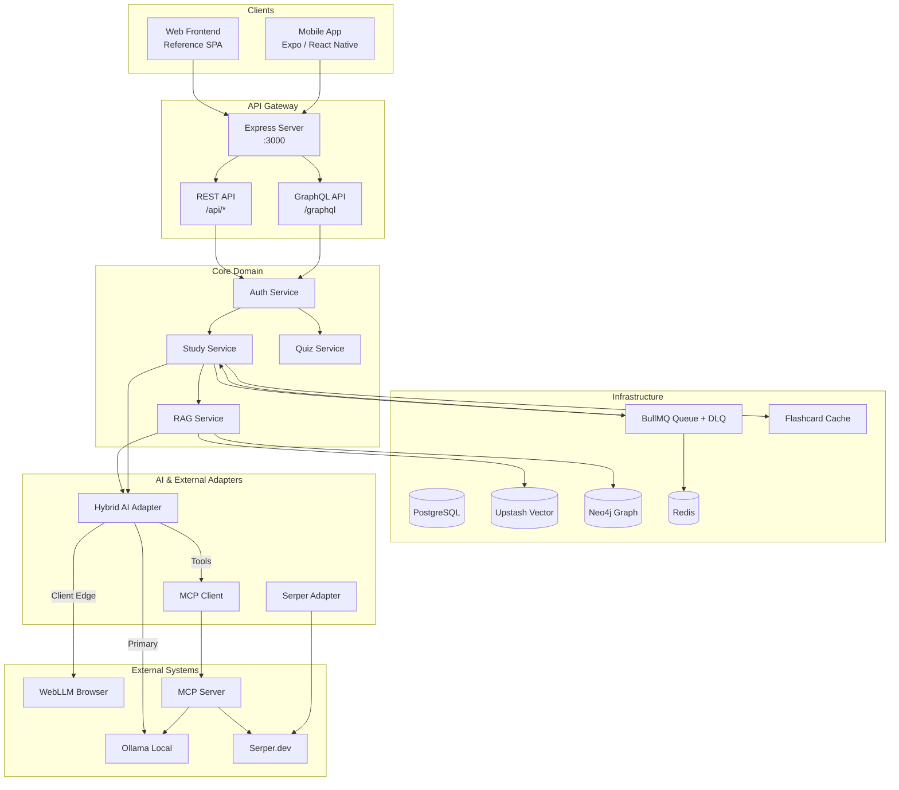
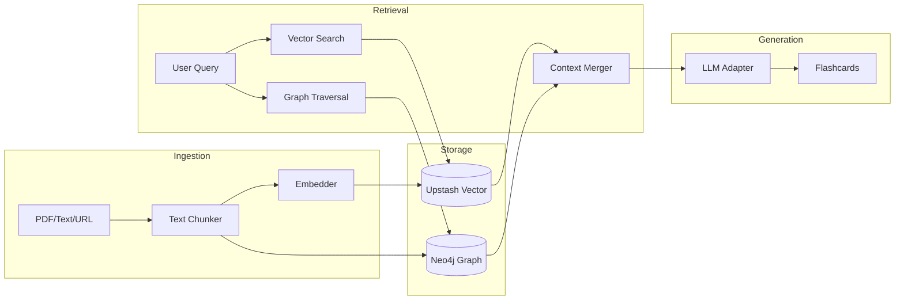

# MindFlip AI - System Architecture

**Last Updated**: 2025-12-13  
**Version**: 3.0 (RAG Architecture with Neo4j & Vector Search)

## High-Level Architecture



## RAG Pipeline Architecture

The RAG (Retrieval-Augmented Generation) system enhances flashcard generation by providing relevant context from previously ingested content.



### Key Components

| Component | Technology | Purpose |
|-----------|------------|---------|
| **RAGService** | TypeScript | Orchestrates ingestion and retrieval |
| **RAGWorkflow** | LangGraph | Multi-step workflow with state management |
| **Neo4jAdapter** | neo4j-driver | Knowledge graph operations |
| **UpstashVectorService** | Upstash SDK | Vector embeddings and similarity search |

### Data Flow

1. **Ingestion**: Content is chunked, embedded, and stored in both vector DB and knowledge graph
2. **Query**: User's topic is used for both semantic search (vector) and relationship traversal (graph)
3. **Merge**: Results from both sources are combined into a unified context
4. **Generate**: LLM generates flashcards with the enriched context

## Mobile App Architecture


## Request Flow

### 1. Authenticated Flashcard Generation


### 2. MCP Circuit Breaker Flow


## Component Details

### Backend Services

| Service | Port | Purpose | Key Features |
|---------|------|---------|--------------|
| Express Server | 3000 | Main API | REST + GraphQL |
| MCP Server | stdio | Tool orchestration | Ollama, Storage, DB |
| Ollama | 11434 | Local LLM | llama3.2:latest |
| Queue Worker | - | Async processing | BullMQ |

### Data Flow

```
Client Request
    ↓
Auth Middleware → Rate Limiter
    ↓
Service Layer (StudyService)
    ↓
Queue System (BullMQ)
    ↓
Worker Process
    ↓
[Future: LangGraph Orchestration]
    ↓
StudyService (Parallel: AI Summary + Web Content)
    ↓
Hybrid Adapters (MCP-first)
    ↓
MCP Client ↔ MCP Server
    ↓           ↓
Direct      MCP Tools
Fallback    (Ollama, Storage, etc.)
    ↓
External Services
```

### Storage Structure

```
.data/
├── flashcards/          # Deck storage
├── quizzes/             # Quiz sessions
├── metrics/             # Performance data
└── cache/              # LLM cache

.metrics/               # Metrics logs
```

## Security Architecture


### Auth Flow

1. **Login**: OAuth (Google) → JWT creation
2. **Token**: JWE (encrypted) with 2hr expiration
3. **Validation**: Every protected endpoint
4. **Storage**: Singleton AuthService, consistent secret

## Resilience Patterns

### 1. Circuit Breaker (MCP)
- **Closed**: Normal operation via MCP
- **Open**: Direct Ollama after failures
- **Half-Open**: Test reconnection periodically

### 2. Graceful Degradation
- MCP unavailable → Direct adapters
- Ollama down → Web search + synthesis
- Cache miss → Fresh generation

### 3. Queue-Based Processing
- Async flashcard generation
- Job status tracking
- Retry on failure
- Dead letter queue

## Technology Stack

### Backend
- **Runtime**: Node.js 22.x
- **Framework**: Express.js
- **Language**: TypeScript
- **Queue**: BullMQ (Redis)
- **GraphQL**: Apollo Server
- **Auth**: jose (JWE tokens)

### AI/ML
- **Local LLM**: Ollama (llama3.2:latest)
- **MCP**: Model Context Protocol
- **LangGraph**: Workflow orchestration
- **Web Search**: Serper API

### Mobile App (New)
- **Framework**: React Native with Expo
- **Routing**: Expo Router (File-based routing like Next.js)
- **Styling**: NativeWind (Tailwind CSS for Native)
- **State**: React Hooks + Context
- **AI**: WebLLM Bridge (runs local LLM in WebView)

### Frontend (Reference SPA)
- **Build**: esbuild
- **Framework**: Vanilla JS + TypeScript
- **State**: Event-driven Controller pattern

## Deployment Architecture


## Environment Configuration

```bash
# Required
JWE_SECRET_KEY=<64-char-hex>
SERPER_API_KEY=<api-key>

# Optional
OLLAMA_HOST=http://localhost:11434
NODE_ENV=development
REDIS_URL=redis://localhost:6379

# Testing
TEST_AUTH_TOKEN=<generated-token>
```

## Performance Metrics

- **Auth**: <5ms (token validation)
- **Cache Hit**: <10ms  
- **Ollama**: 2-30s (model dependent)
- **Queue**: <50ms (job enqueue)

## Next Architecture Steps

1. ✅ MCP-first architecture (Complete)
2. ⏳ LangGraph integration (Started)
3. [ ] Distributed caching (Redis)
4. [ ] Horizontal scaling
5. [ ] CDN for static assets
