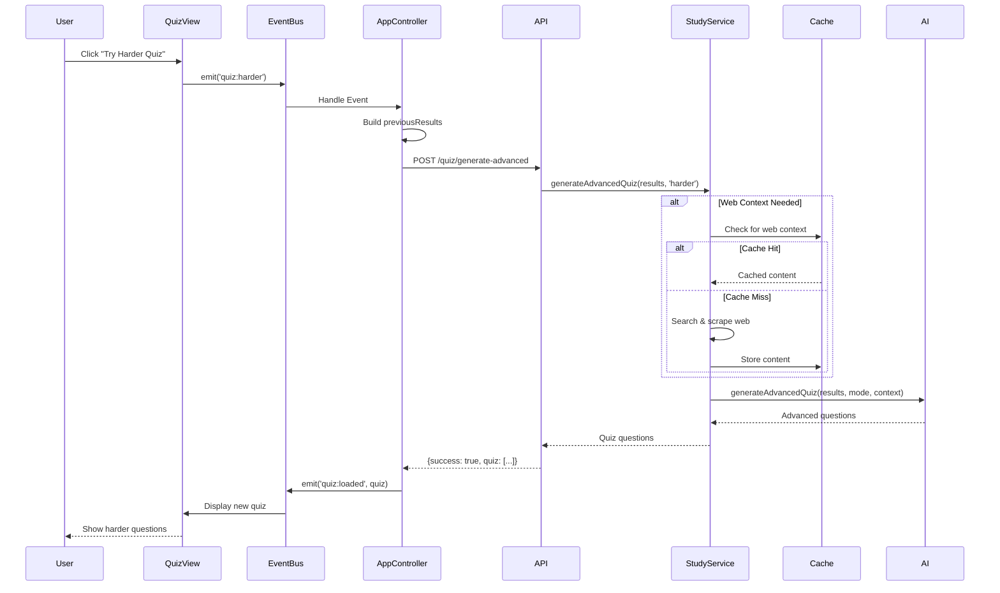

# Advanced Quiz System ("Try Harder Quiz")

## Overview
The Advanced Quiz system generates more challenging questions by incorporating real-time web content related to the quiz topic, providing users with deeper, more comprehensive assessments.

## Architecture

```mermaid
graph TB
    User[User Completes Quiz] --> Button{Score >= 80%?}
    Button -->|Yes| ShowHarder[Show "Try Harder Quiz" Button]
    Button -->|No| ShowRetry[Show "Retry" Button]
    
    ShowHarder --> ClickHarder[User Clicks Button]
    ClickHarder --> EmitEvent[Emit 'quiz:harder' Event]
    
    EmitEvent --> Handler[Event Handler]
    Handler --> BuildPayload[Build Previous Results]
    BuildPayload --> APICall[POST /api/quiz/generate-advanced]
    
    APICall --> Server[Server Endpoint]
    Server --> StudyService[StudyService.generateAdvancedQuiz]
    StudyService --> ModeCheck{Mode?}
    
    ModeCheck -->|harder| GetContext[getCachedOrFreshWebContext]
    ModeCheck -->|remedial| SkipContext[No Context Needed]
    
    GetContext --> CacheCheck{Cache Hit?}
    CacheCheck -->|Yes| UseCached[Use Cached Context]
    CacheCheck -->|No| FetchFresh[Fetch Fresh Web Content]
    
    UseCached --> Synthesize[Synthesize Context]
    FetchFresh --> Synthesize
    SkipContext --> Synthesize
    
    Synthesize --> AIAdapter[Call AI Adapter]
    AIAdapter --> GenerateQuiz[Generate Advanced Quiz]
    GenerateQuiz --> ReturnQuiz[Return Quiz to Frontend]
    ReturnQuiz --> Display[Display New Quiz]
    
    style GetContext fill:#fff3cd
    style CacheCheck fill:#cfe2ff
    style GenerateQuiz fill:#d4edda
```

## Request Flow

### 1. Frontend Event Emission

**Trigger**: Button click on quiz results popup

**Location**: `quiz.view.ts`
```typescript
harderBtn.addEventListener('click', () => {
    this.hide(this.elements.popup);
    eventBus.emit('quiz:harder', null);
});
```

### 2. Event Handler

**Location**: `app.controller.ts`
```typescript
eventBus.on('quiz:harder', async () => {
    const previousResults = {
        topic: deckModel.currentTopic || 'General Knowledge',
        questions: quizModel.questions,
        userAnswers: quizModel.answers,
        correctAnswers: quizModel.questions.map(q => q.correctAnswer)
    };
    
    const response = await apiService.post('/quiz/generate-advanced', {
        previousResults,
        mode: 'harder'
    });
    
    if (response?.quiz) {
        eventBus.emit('quiz:loaded', response.quiz);
    }
});
```

### 3. Server Endpoint

**Location**: `server.ts`
```typescript
app.post('/api/quiz/generate-advanced', async (req, res) => {
    const { previousResults, mode } = req.body;
    const quiz = await studyService.generateAdvancedQuiz(previousResults, mode);
    res.json({ success: true, quiz });
});
```

### 4. Service Logic

**Location**: `StudyService.ts`
```typescript
async generateAdvancedQuiz(
    previousResults: any, 
    mode: 'harder' | 'remedial'
): Promise<QuizQuestion[]> {
    let context = '';
    
    if (mode === 'harder' && previousResults.topic) {
        // Cache-first web context retrieval
        context = await this.getCachedOrFreshWebContext(previousResults.topic);
    }
    
    return this.getAdapter('ollama').generateAdvancedQuiz(
        previousResults, 
        mode, 
        context
    );
}
```

## Data Flow Diagram



## Context Enhancement

### Without Web Context
```json
{
  "question": "What is a variable in JavaScript?",
  "options": ["...", "...", "...", "..."],
  "correctAnswer": "A container for storing data values"
}
```

### With Web Context
```json
{
  "question": "In JavaScript, how does block-scoping with 'let' differ from function-scoping with 'var' in terms of the temporal dead zone?",
  "options": [
    "'let' creates a temporal dead zone from block start to declaration",
    "'var' creates a temporal dead zone in async functions only",
    "Both have identical temporal dead zone behavior",
    "Temporal dead zone only applies to 'const' declarations"
  ],
  "correctAnswer": "'let' creates a temporal dead zone from block start to declaration"
}
```

## Modes

### 1. Harder Mode
- **Trigger**: Score >= 80%
- **Context**: Web-enhanced
- **Difficulty**: Advanced concepts, edge cases, deep understanding
- **Sample Topics**: 
  - "Advanced JavaScript closures and lexical scope"
  - "React performance optimization techniques"
  - "Database transaction isolation levels"

### 2. Remedial Mode
- **Trigger**: Low score or specific weak areas
- **Context**: Not used (focuses on basics)
- **Difficulty**: Reinforcement of fundamentals
- **Sample Topics**: Base concepts from previous quiz

## Performance

| Phase | Time | Notes |
|-------|------|-------|
| Button Click | <10ms | Event emission |
| API Call | 50-100ms | Network + auth |
| Cache Check | <10ms | In-memory lookup |
| Web Fetch (miss) | 3-5s | Search + scrape |
| AI Generation | 2-4s | LLM processing |
| **Total (cache hit)** | **2-4s** | Optimal path |
| **Total (cache miss)** | **5-9s** | First time |

## Logging

Comprehensive logging at each stage:

```log
[AppController] quiz:harder event received
[AppController] Previous results: {topic: "javascript", ...}
[AppController] Calling apiService.post with /quiz/generate-advanced
[Server] POST /api/quiz/generate-advanced received
[Server] Generating advanced quiz - mode: harder, topic: javascript
[StudyService.generateAdvancedQuiz] START
[StudyService] Getting web context for advanced quiz on: javascript
[Cache Hit] Using cached web context for: javascript
[StudyService] Web context retrieved, length: 8437 chars
[StudyService] Calling adapter.generateAdvancedQuiz
[StudyService.generateAdvancedQuiz] COMPLETE - Generated 5 questions
[Server] Advanced quiz generated: 5 questions
[AppController] Quiz received, emitting quiz:loaded event
```

## UI States

### Button Visibility Logic

```typescript
if (percentage === 100) {
    // Perfect score - show harder quiz
    showButton('btn-quiz-harder');
} else if (percentage >= 80) {
    // Good score - show harder quiz + retry
    showButton('btn-quiz-harder');
    showButton('btn-quiz-retry');
} else {
    // Low score - show retry + revise
    showButton('btn-quiz-retry');
    showButton('btn-quiz-revise');
}
```

## Error Handling

1. **Event Handler Errors**: Caught and logged, user sees alert
2. **API Errors**: 500 response with error message
3. **Context Retrieval Failure**: Proceeds without context (degraded mode)
4. **AI Generation Failure**: Falls back to basic quiz generation

## Future Enhancements

- [ ] Difficulty slider (not just harder/remedial)
- [ ] Multi-level progression (Bronze → Silver → Gold)
- [ ] Spaced repetition integration
- [ ] Performance analytics per topic
