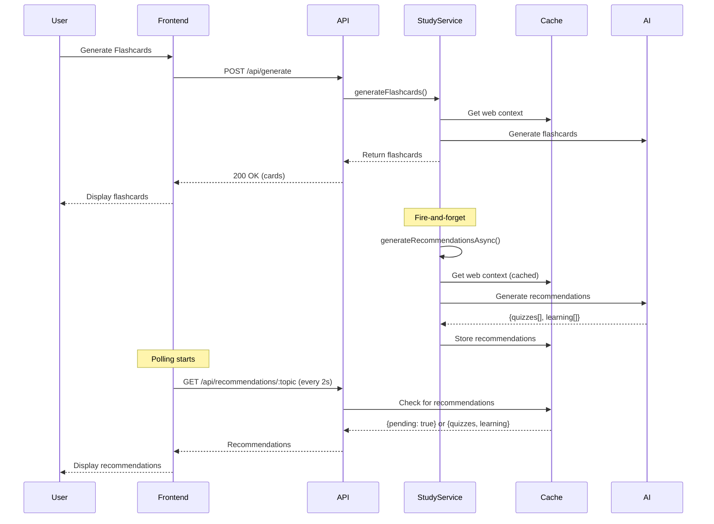
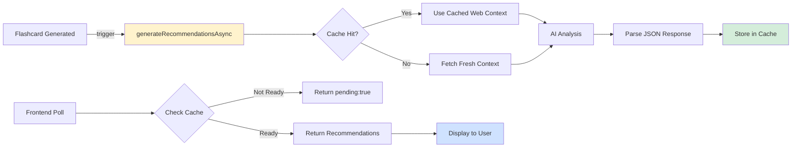

# Async Recommendations System

## Overview
The async recommendations system generates related quiz topics and learning paths in the background after flashcard generation, providing personalized learning suggestions without blocking the main request flow.

## System Architecture



## Components

### 1. Background Generation

**Location**: `StudyService.ts`

```typescript
async generateRecommendationsAsync(topic: string): Promise<void> {
    // Fire-and-forget - errors are logged but don't block
    try {
        const webContext = await this.getCachedOrFreshWebContext(topic);
        
        const prompt = `Based on content about "${topic}", suggest:
        1. Three related quiz topics
        2. Three learning paths
        
        JSON format:
        {
          "recommendedQuizzes": ["topic1", "topic2", "topic3"],
          "recommendedLearning": ["path1", "path2", "path3"]
        }`;
        
        const response = await this.getAdapter('ollama').generateBriefAnswer(
            'Generate recommendations', 
            prompt
        );
        
        const recommendations = JSON.parse(response);
        this.webContextCache.set(`recommendations:${topic}`, JSON.stringify(recommendations));
    } catch (err) {
        console.warn(`Recommendation generation failed for ${topic}`);
    }
}
```

### 2. API Endpoints

**Location**: `server.ts`

#### GET /api/recommendations/:topic
Returns cached recommendations or pending status.

**Response (pending)**:
```json
{
  "success": true,
  "topic": "javascript",
  "recommendedQuizzes": [],
  "recommendedLearning": [],
  "pending": true
}
```

**Response (ready)**:
```json
{
  "success": true,
  "topic": "javascript",
  "recommendedQuizzes": [
    "JavaScript Closures Deep Dive",
    "Async/Await Patterns",
    "ES6 Features"
  ],
  "recommendedLearning": [
    "Advanced Functions",
    "Promises and Async Programming",
    "Modern JavaScript Ecosystem"
  ]
}
```

#### POST /api/recommendations/refresh/:topic
Triggers fresh recommendation generation.

### 3. Frontend Polling

**Location**: `generator.view.ts`

```typescript
async pollForRecommendations(topic: string) {
    let attempts = 0;
    const maxAttempts = 5; // 10 seconds total (5 × 2s)
    
    const poll = async () => {
        const response = await apiService.get(`/recommendations/${encodeURIComponent(topic)}`);
        
        if (response.recommendedQuizzes?.length > 0 || 
            response.recommendedLearning?.length > 0) {
            this.displayRecommendations(response);
            return; // Stop polling
        }
        
        attempts++;
        if (attempts < maxAttempts) {
            setTimeout(poll, 2000); // Poll again in 2s
        }
    };
    
    setTimeout(poll, 2000); // Start after 2s
}
```

## Data Flow



## Cache Strategy

- **Key Format**: `recommendations:{topic}`
- **TTL**: 24 hours (same as web context)
- **Storage**: In-memory (LRU cache)
- **Max Entries**: 100

## Performance Characteristics

| Metric | Value |
|--------|-------|
| Generation Time | 3-5s (background) |
| Polling Interval | 2s |
| Max Poll Duration | 10s (5 attempts) |
| Success Rate | >95% (within 10s) |
| User Impact | Zero (non-blocking) |

## UI Integration

### Display Component
```html
<div id="recommendations-container" style="display: none;">
  <!-- Populated by displayRecommendations() -->
</div>
```

### Styling
- Gradient background (#667eea → #764ba2)
- White text
- Rounded corners (12px)
- Appears below flashcards

## Error Handling

1. **Generation Failure**: Logged to console, user unaffected
2. **Polling Timeout**: Recommendations simply don't appear
3. **Parse Error**: Caught and logged, no user impact
4. **Cache Miss**: Returns `pending: true`, polling continues

## Future Enhancements

- [ ] WebSocket push instead of polling
- [ ] Personalization based on user history
- [ ] Recommendation quality scoring
- [ ] A/B testing for prompt variations
