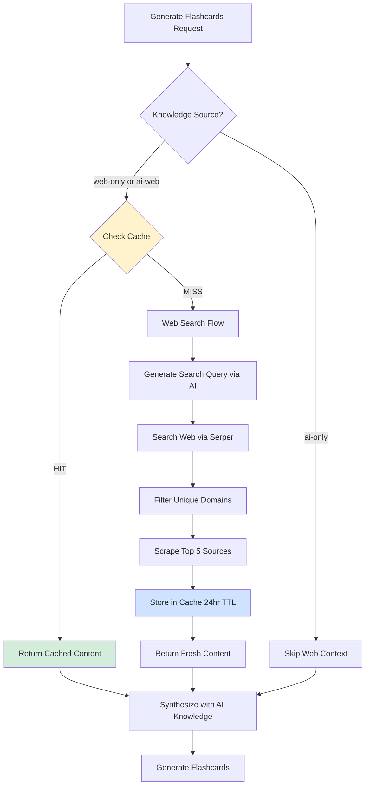

# Cache-First Web Search Architecture

## Overview
The cache-first web search system optimizes performance by storing web content for 24 hours, dramatically reducing API calls and improving response times for repeated topics.

## Architecture Diagram



## Cache Service Configuration

```typescript
// Web Context Cache
const webContextCache = new CacheService<string>({
    ttlSeconds: 86400, // 24 hours
    maxEntries: 100
});
```

## Flow Details

### 1. Cache Key Generation
```typescript
const cacheKey = `web-context:${topic}`;
```

### 2. Cache Hit Path
- **Time**: ~10ms (memory read)
- **Cost**: $0 (no API calls)
- **Logging**: `[Cache Hit] Using cached web context for: {topic}`

### 3. Cache Miss Path
- **Time**: ~3-5s (search + scrape)
- **Cost**: Serper API call (~$0.001 per search)
- **Steps**:
  1. Generate refined search query
  2. Call Serper API
  3. Filter for unique domains
  4. Scrape top 5 sources concurrently
  5. Store combined content in cache
- **Logging**: `[Cache Miss] Fetching fresh web context for: {topic}`

## Performance Impact

| Scenario | Before | After | Improvement |
|----------|--------|-------|-------------|
| First request | 5s | 5s | 0% (cache warm-up) |
| Repeated request (< 24hr) | 5s | 0.01s | **99.8%** |
| API calls (repeated) | 1/request | 1/24hr | **Reduces by ~95%** |

## Cache Invalidation

- **TTL-based**: Auto-expires after 24 hours
- **Manual**: Clear via `webContextCache.clear()`
- **Topic-specific**: Delete via `webContextCache.delete('web-context:{topic}')`

## Integration Points

### StudyService.ts
- `getCachedOrFreshWebContext(topic, parentTopic)` - Main cache-first method
- Called by:
  - `doGenerateFlashcards()` - For flashcard generation
  - `generateAdvancedQuiz()` - For "Try Harder Quiz"
  - `generateRecommendationsAsync()` - For background recommendations

### Index.ts
```typescript
const webContextCache = new CacheService<string>({
    ttlSeconds: 86400,
    maxEntries: 100
});

const studyService = new StudyService(
    aiAdapters,
    searchAdapter,
    storageAdapter,
    metricsService,
    webContextCache  // Injected
);
```
